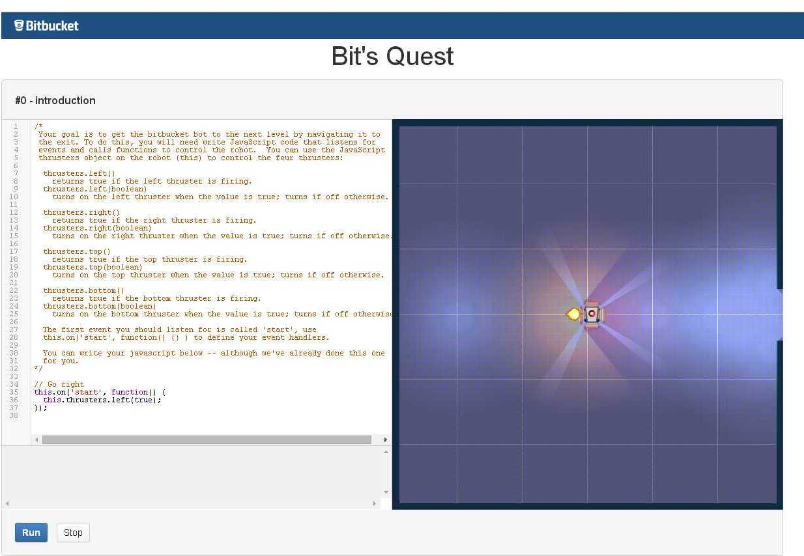

# bitsquest
a clone of bitquest (for translation)

Bit's Quest

Program your way through 15 levels.
Play
http://bitsquest.bitbucket.org/
Improve
Fair warning: It's a mess.
Things that could use improvement:
More levels
Use a real physics library
Improve error handling
Proper partitioning of the render graph.
Additional languages
Everything else -- a complete rewrite would probably help. :)
Questions, comments, concerns, contact dbennett@atlassian.com or ddbennett on twitter.
Everything not already covered under a separate license (i.e., jquery, underscore, backbone, codemirror) is released under the APL v2 (see LICENSE file for official notice).
